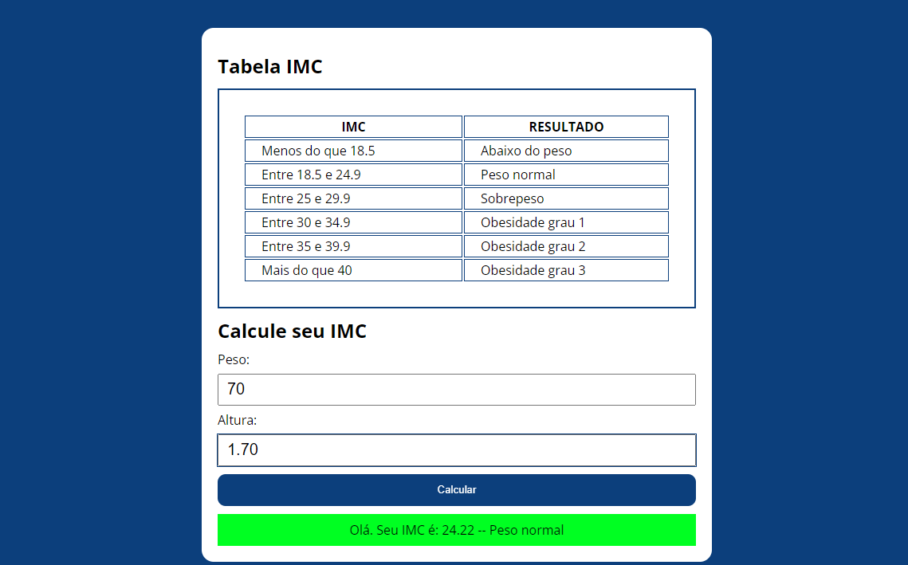

<h1 align="center"> Calculadora de IMC</h1>

Projeto feito para treinar minhas habilidades de lógica em JavaScript.  

### 🛠 Tecnologias

As seguintes ferramentas foram usadas na construção do projeto:

- [JavaScript]
- [HTML]
- [CSS]

---

---

Feito por: Pedro Gonçalves
